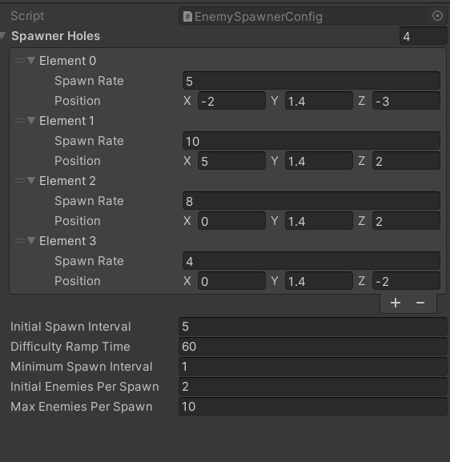
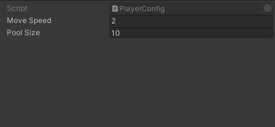
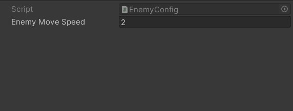
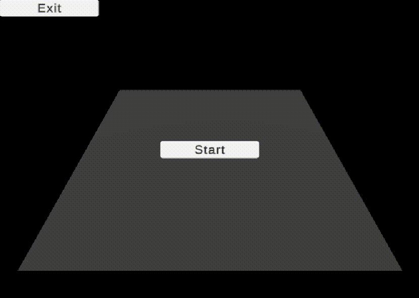

# Shooter-Cylinder

This is my test project for hiring.

## Information

In this game, the player must try to kill enemies that spawn from various points on the ground and survive for as long as possible.
At the end of the game we calculate the score based on your kill count and your gameplay time.
I tried to use various things in developing this game, such as custom Dependency injection, Observer pattern,Object polling, None monoBehaviour classes, etc.
You can customize the configurations related to enemy spawning as well as the configurations for the player and enemies.

**Configs**:

### Example:

## Unity version

- <a  href="unityhub://2021.3.33f1/ee5a2aa03ab2" target="_blank"> 2021.3.33f1 </a>
